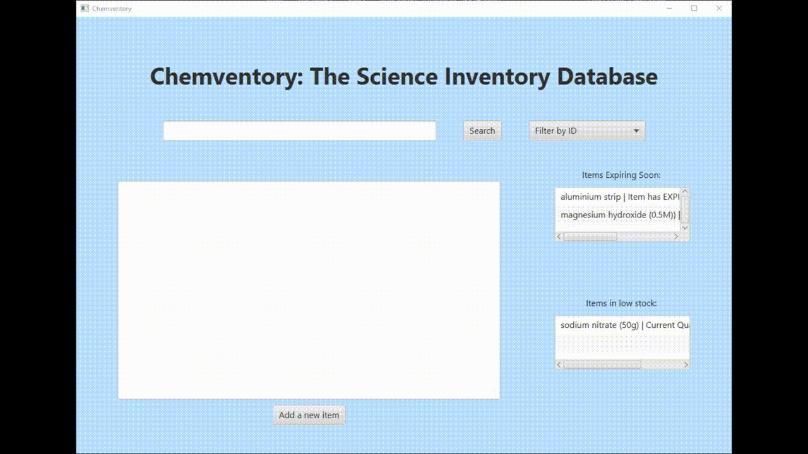

# Chemventory

Chemventory is a database software aimed at assisting science departments in keeping track of their apparatus and chemicals. It has an easy-to-use interface with a database entry system that allows you to add: Product ID, Product name, Product category, Product description, Purchasing date, Expiry date, Quantity, Safety notes, General notes, Product usage, and Department. The program's purpose is to keep stock organized, and make the 'inventorying' task easier by notifying the user of low stock and soon-to-be expired products.

Demo:

